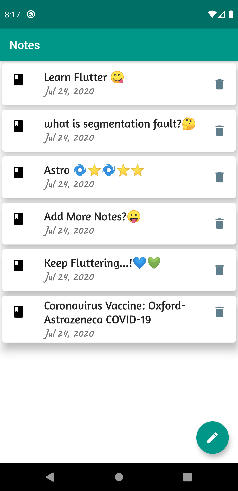

# Note-App

<p align="center">
  
</p>

A Minimal Note Application in Flutter

## Packages
-  sqflite
-  path_provider
-  intl ^0.16.1

look for these packages at [pub.dev](pub.dev)

## Build And Run

you can [download](https://drive.google.com/file/d/1shdgE41ldGf6Xb7fXAWYRHuhE53UHZ3e/view?usp=sharing) the release apk for Android 32-bit device directly from [here](https://drive.google.com/file/d/1shdgE41ldGf6Xb7fXAWYRHuhE53UHZ3e/view?usp=sharing)

if you wish to run the build the code on your system follow the steps below

Clone the repository
```
git clone git@github.com:ayaankhan98/Note_App.git
```
Get into the directory
```
cd Note_App
```
Install pub dependencies
```
flutter pub get
```
Check available emulators
```
flutter emulators
```
you will see available emulators on your machine select the id of emulator on which you wish to run the app
```
flutter emulators --launch YOUR_EMULATOR_ID
```
Finally the app is running on your machine

## Preview
<table>
<tr>
<td></td>
<td></td>
</tr>
</table>
